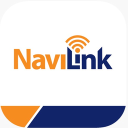

# Navien

Кастомная интеграция для [Home Assistant](https://www.home-assistant.io) · версия **1.5.2**.

| | |
|---|---|
| Домен | `navien` |
| Версия | 1.5.2 |
| Тип | custom integration |

## Описание

Интеграция котлов Navien через NaviLink (вода, температура, режимы).

## Возможности

- Числовые настройки и параметры
- Сенсоры и мониторинг состояния
- Переключатели и вкл/выкл устройства
- Управление водонагревателем

## Установка

1. Скопируйте папку `custom_components/{domain}/` в каталог `custom_components/` конфигурации Home Assistant.
2. Перезапустите Home Assistant.
3. Настройки → Устройства и службы → Добавить интеграцию → **{mname}**.

> Установка через HACS: добавьте репозиторий `https://github.com/bezuglyy/{repo}` как Custom repository (категория Integration).

## Лицензия

MIT
